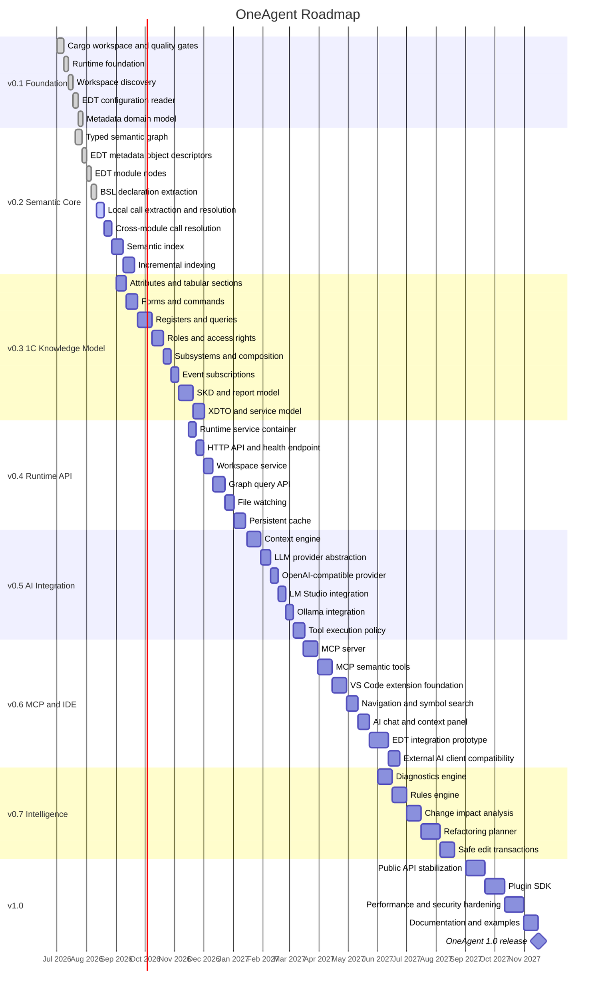

# OneAgent Roadmap

## Vision

**OneAgent** — кроссплатформенная платформа интеллектуальной разработки для `1C:Enterprise`, основанная на семантической модели конфигурации, графе знаний и интеграции с локальными и облачными LLM.

## Product roadmap

## Release goals

### v0.1 — Foundation
Stable Rust workspace, Runtime composition root, cross-platform CI, EDT workspace discovery, base metadata model.

### v0.2 — Semantic Core
Typed semantic graph, real EDT UUIDs, module/procedure/function nodes, local and cross-module call graph, semantic and incremental indexes.

### v0.3 — 1C Knowledge Model
Attributes, tabular sections, forms, commands, registers, queries, roles, access rights, subsystems, SKD, XDTO and services.

### v0.4 — Runtime API
Long-running runtime, workspace lifecycle, file watching, graph-query API and persistent cache.

### v0.5 — AI Integration
Context engine, LLM abstraction, LM Studio, Ollama and OpenAI-compatible endpoints.

### v0.6 — MCP and IDE
MCP server, VS Code extension, EDT integration, navigation and semantic tools.
OneAgent should expose its semantic graph, query, validation, diagnostics,
impact, and context capabilities through MCP so external AI clients such as
Codex, Cursor, and cloud agents can consume OneAgent without product-specific
core integrations.

### v0.7 — Intelligence
Diagnostics, impact analysis, planning, refactoring and safe edit transactions.

### v1.0 — Stable Platform
Stable APIs, plugin SDK, performance/security hardening, documentation and examples.

## Sprint 3 Semantic Coverage

- [x] Add a deterministic Semantic Coverage Audit for graph-domain and EDT-specific capabilities.
- [ ] Complete Semantic Coverage; the audit does not mark completion itself.

Ordered follow-up work:

1. **Critical — completed:** retain unresolved BSL calls as typed diagnostics and resolution statistics.
2. **High — completed:** discover and emit top-level Common Command metadata (`metadata_entity.command`); typed payload preservation is also complete.
3. **High — completed:** classify generic top-level Form entity and node capabilities as not applicable to EDT; real common and subordinate forms use distinct semantic kinds.
4. **High — completed:** discover and emit top-level Common Template metadata (`metadata_entity.template`); typed payload preservation is also complete.
5. **High — completed:** classify fallback-only `metadata_entity.unknown` as not applicable to EDT without emitting synthetic entities.
6. **High — completed:** map EDT accounting-register resources to stable, provenance-backed `Measure` nodes (`semantic_node.measure`).
7. **High — completed:** classify fallback-only `semantic_node.metadata.unknown` as not applicable to EDT without emitting synthetic metadata nodes.
8. **High — completed:** emit static BSL Query declarations as stable, provenance-backed `NodeKind::Query` nodes; query-language parsing and data-access edges remain separate.
9. **High — completed:** emit flat EDT role semantic nodes while preserving `NodeKind::Metadata(MetadataKind::Role)` object nodes.
10. **High — completed:** derive EDT document `StandardAttribute` nodes with stable identity, ownership, and provenance.
11. **High — completed:** emit flat EDT `Subsystem` semantic nodes while preserving `NodeKind::Metadata(MetadataKind::Subsystem)` object nodes.
12. **High — completed:** classify fallback-only flat `semantic_node.unknown` as not applicable to EDT without emitting synthetic unknown nodes.
13. **High — completed:** recognize EDT accounting-register `Measure` ownership through the existing `Contains` edge from the owning metadata object.
14. **High — completed:** recognize EDT document `StandardAttribute` ownership through the existing `Contains` edge from the owning metadata object.
15. **High — completed:** implement the first production slice for declared `DependsOn` semantic edges using the accepted contract in `docs/adr/0017-depends-on-semantics.md`.
16. **High — completed:** preserve immediate tabular-section ownership for nested attributes with owner-scoped fallback identity, provenance-backed `Contains` edges, generic Query navigation, and deterministic production integration evidence.
17. **High — completed:** implement the first production slice for declared `Extends` semantic edges using the accepted contract in `docs/adr/0018-extends-semantics.md`.
18. **High — completed:** implement the first production slice for declared `Grants` semantic edges using the accepted contract in `docs/adr/0019-grants-semantics.md`; EDT role-right declarations now resolve to scoped `AccessRight` nodes and canonical Grants edges with deterministic provenance.
19. **High — completed:** implement the direct top-level EDT Subsystem `<content>` slice for `Includes` using `docs/adr/0020-includes-semantics.md`; the production builder now normalizes the explicit allowlist, resolves exact metadata targets, emits deterministic provenance-backed Includes edges, reports typed negative outcomes, enforces the precise validator matrix, and verifies generic queries and Impact exclusion.
20. **High — completed:** implement and transition the first `Reads` slice defined by `docs/adr/0021-reads-semantics.md`; parsing, multiline BSL decoding and private source mapping, typed positive and negative classification, exact resolution, validation, emission, provenance, raw fixtures, deterministic parser/full-builder tests, and `semantic_edge.reads` Coverage evidence are complete.
21. **High — completed:** implement and transition the first `Writes` slice defined by `docs/adr/0022-writes-semantics.md`; typed Document register declarations, complete zero-argument `RegisterRecords.<Name>.Write()` candidate extraction in Document Object Module Procedures, exact declaration and metadata resolution, precise validation, deterministic provenance-backed production emission, typed diagnostics, Query and Impact behavior, negative, duplicate, and repeated-build evidence, and `semantic_edge.writes` Coverage evidence are complete. Writes and query-derived `DependsOn` are not inferred from Reads, Calls, Grants, declarations alone, or the bare method name.
22. **Medium — completed:** the
    typed metadata payload contract from
    `docs/adr/0023-typed-metadata-payload.md` is implemented across the metadata
    domain, graph equality/diff/Query integration, common EDT synonym and typed
    Document register-record conversion, and complete deterministic per-kind
    production evidence. All 21 applicable EDT metadata-entity capabilities now
    have complete evidence and `Supported` status; Form and Unknown remain
    `NotApplicable`.
23. **Medium — completed:** add successful production-builder evidence for all
    nine mapped metadata reference target kinds; Catalog, Document,
    Enumeration, Information Register, Accumulation Register, Accounting
    Register, Calculation Register, Business Process, and Task references now
    share one deterministic representative integration test covering exact
    targets, `References`, companion `DependsOn`, provenance, Query, validation,
    resolution statistics, and repeated builds.
24. **Medium — completed:** implement the public source-independent
    reference-request ledger defined by
    `docs/adr/0024-reference-request-provenance.md`; graph-domain identity,
    lifecycle, Query/report/diff/validation integration, EDT metadata-reference
    migration, collection-time provenance, projection consistency, production
    evidence, and independent graph-domain and EDT Coverage transitions are
    complete for the accepted metadata-reference first slice.
25. **Medium — completed:** implement
    `docs/adr/0025-references-endpoint-validation.md`; `References` now accepts
    exactly the 27 metadata-member pairs and five AccessRight resource pairs
    emitted by current production, with exhaustive deterministic positive and
    negative validator evidence. All nine EdgeKind rules now match their
    accepted ownership or first-slice contracts. Coverage status and counts are
    unchanged.

The EDT Coverage Registry currently contains 0 Critical gaps, 0 High gaps, and
12 Medium gaps. Combined with the Graph Domain registry, Semantic Coverage
contains 0 Critical gaps, 0 High gaps, and 12 Medium gaps. Sprint 3 Integration
Review is no longer blocked by High gaps; this status does not mean that the
review itself has been performed.

The first production slice for `semantic_edge.depends_on` is implemented and
the capability is supported. The first production slice for
`semantic_edge.extends` and `semantic_edge.grants` are implemented and
supported. The first production slice for `semantic_edge.includes` is also
implemented and supported: direct `<content>` observations from discovered
top-level Subsystem descriptors are normalized through the explicit allowlist,
resolved by exact metadata kind and name, emitted as canonical Includes edges,
and covered by precise validation, typed failures, deterministic provenance,
generic query, and Impact-exclusion evidence.

The first `semantic_edge.reads` architecture contract is accepted and the EDT
pipeline emits canonical provenance-backed Reads edges from existing Query nodes
for one completely parsed top-level `SELECT` with one direct Catalog or
Information Register source. Parser investigation, typed diagnostics, exact
resolution, precise endpoint validation, emission, Query and Impact behavior,
negative outcomes, and repeated-build production evidence are complete for the
accepted forms. The confirmed multiline BSL decoder and private source map,
explicit unsupported-structure, virtual-table, and temporary-table diagnostics,
raw fixtures, deterministic parser/full-builder negative evidence, and the
registry-only Coverage transition are complete. The capability is `Supported`.
The first `semantic_edge.writes` architecture contract is accepted in
`docs/adr/0022-writes-semantics.md`. Its canonical direction is
`Procedure --Writes--> Metadata(AccumulationRegister)` for the exact
Document-register source contract; file, binary, text, archive, UI, external,
dynamic, local-object, argument-bearing, and otherwise unresolved writes remain
outside the first slice. Typed Document register declarations, complete
candidate extraction, exact resolution, precise validation, production
emission, deterministic provenance, typed diagnostics, integration, Query,
Impact, negative, duplicate, and repeated-build evidence, and the registry-only
Coverage transition are complete. The capability is `Supported`. No deferred
Writes family or write-derived `DependsOn` origin is added by this transition.

The detailed capability inventory, missing evidence, acceptance criteria, and
out-of-scope boundaries are recorded in `docs/architecture/semantic-model-2.md`.

## Definition of Done

- `cargo fmt --all -- --check`
- `cargo check --workspace`
- `cargo test --workspace`
- `cargo clippy --workspace --all-targets --all-features -- -D warnings`
- `cargo doc --workspace --no-deps`
- Architecture changes documented by ADR.
- Public APIs documented.
- Tests cover success and failure paths.
