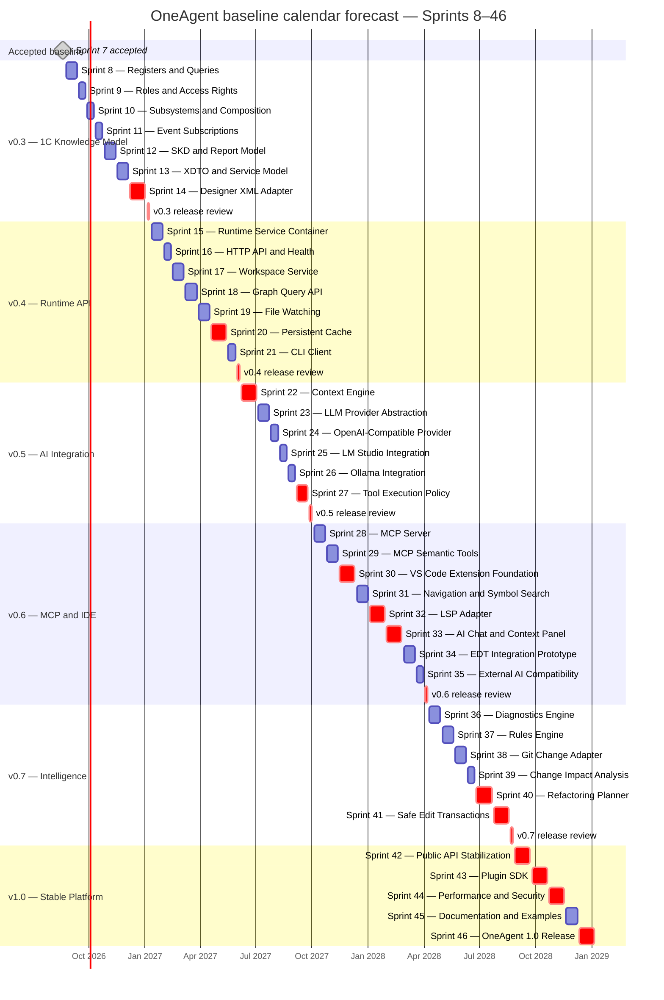

# OneAgent Calendar Roadmap Forecast

## Current forecast — 2026-08-20 rebaseline

This forecast supersedes the 2026-08-19 calendar baseline retained below for
comparison. It is a planning model, not a delivery commitment, and does not
replace dependency order or authoritative status in `docs/Roadmap.md`.

### Current schedule variance — 2026-08-26

The current delay relative to the nominal execution schedule is caused by the
deployment and configuration of the local engineering-assistant server. This
infrastructure work includes the pinned CUDA toolkit, the `llama.cpp` build and
service setup, and the supporting deployment configuration documented in the
[Local Engineering Assistant Deployment Runbook](local-engineering-assistant/Local_Engineering_Assistant_Deployment_Runbook.md).
It does not change sprint dependency order, scope, or completion status. The
schedule must be rebaselined from current repository evidence after the server
setup is complete; this note does not assign an unsupported delay duration or
new delivery date.

The rebaseline starts from the committed Sprint 12 review head
`cf59854baebc6fe88add0de5a0e5b6858b755a19`:

- Sprints 1–12 are completed;
- Sprint 13 is the next planning target;
- Sprints 13–46 remain sequential;
- the next weekly limit reset is 2026-08-27;
- the current global weekly remainder is 76 percentage points;
- the project may use at most 70 percentage points per weekly window;
- the current project remainder is 40 percentage points;
- one completed sprint consumes 6 percentage points on average.

### Observed delivery tempo

Git planning-to-review timestamps provide active execution-span evidence for
the last seven completed sprints:

| Sprint | Planning commit | Review commit | Active span |
|---|---:|---:|---:|
| Sprint 6 | 2026-08-19 14:35 | 2026-08-19 15:20 | 45.4 minutes |
| Sprint 7 | 2026-08-19 16:37 | 2026-08-19 18:23 | 105.5 minutes |
| Sprint 8 | 2026-08-20 11:11 | 2026-08-20 12:01 | 50.1 minutes |
| Sprint 9 | 2026-08-20 12:32 | 2026-08-20 12:55 | 23.0 minutes |
| Sprint 10 | 2026-08-20 13:19 | 2026-08-20 14:13 | 54.5 minutes |
| Sprint 11 | 2026-08-20 15:24 | 2026-08-20 16:42 | 77.8 minutes |
| Sprint 12 | 2026-08-20 17:00 | 2026-08-20 18:12 | 72.2 minutes |

For Sprints 8–12, the mean active span is 55.5 minutes, the median is 54.5
minutes, and the recent-three mean is 68.2 minutes. Five complete sprints were
delivered on 2026-08-20. The base schedule below deliberately uses only two
sprints per active calendar day, leaving substantial execution-time margin.

These timestamps measure the current repository/Codex workflow, not future
human lead time. Runtime, persistence, provider, protocol, IDE, hardening, and
release work can have external waits that are absent from the semantic-model
sprints. Budget-window placement is therefore more reliable than exact
intra-window dates.

### Comparison with the superseded forecast

| Milestone | Superseded forecast | Actual or current forecast | Change |
|---|---:|---:|---:|
| Sprint 8 completion | 2026-09-11 | 2026-08-20 actual | 22 days earlier |
| Sprint 12 completion | 2026-11-13 | 2026-08-20 actual | 85 days earlier |
| v0.3 completion | 2027-01-08 | 2026-08-22 forecast | 139 days earlier |
| OneAgent v1.0 | 2029-01-05 | 2026-09-13 forecast | 845 days earlier |

The old two-to-four-week sprint estimates were useful before a repeatable
execution loop existed, but they no longer describe observed Sprints 8–12.
They remain a long-range risk reference rather than the primary calendar model.

### Budget model

The project remainder is the binding current constraint: 40 project points are
less than the 76-point global remainder. At 6 points per sprint, the current
window safely funds six complete sprints for 36 points and leaves 4 points
before release-gate reserve.

Each separate release integration review is assigned a conservative 3-point
reserve, one half of an average sprint. Sprint 46 already includes the final
v1.0 release review, so no separate final gate is charged. The remaining plan
therefore requires:

```text
34 sprints × 6 points = 204 points
5 separate release reviews × 3 points = 15 points
Base remaining demand = 219 project points
Available through the 2026-09-10 reset = 40 + 70 + 70 + 70 = 250 points
Forecast reserve = 31 points
```

Even if release reviews consume no separate points, 204 points exceed the 180
points available before the 2026-09-10 reset. The budget creates a hard minimum
of four allocation windows; observed execution speed cannot move v1.0 earlier
than the window beginning 2026-09-10.

The supplied residual figures have one accounting ambiguity: interpreting both
as consumption from the same weekly denominator implies 24 global points used
but 30 project points used. The forecast therefore treats 76 and 40 as
independent remaining ceilings and does not reconstruct past consumption.
Dashboard semantics should be confirmed, but this ambiguity does not change
the current 40-point binding limit or the four-window base result.

### Allocation-window forecast

The project allowance is assumed to reset to 70 points with each weekly global
reset. If the project remainder does not reset, only six further average
sprints are currently funded and the forecast beyond Sprint 18 is blocked.

| Budget window | Planned work | Sprint cost | Gate reserve | Total | Buffer | Forecast completion |
|---|---|---:|---:|---:|---:|---:|
| Current window, through 2026-08-26 | Sprints 13–18; v0.3 review | 36 | 3 | 39 of 40 | 1 | Sprint 18 by 2026-08-24 |
| 2026-08-27 through 2026-09-02 | Sprints 19–28; v0.4 and v0.5 reviews | 60 | 6 | 66 of 70 | 4 | Sprint 28 by 2026-08-31 |
| 2026-09-03 through 2026-09-09 | Sprints 29–39; v0.6 review | 66 | 3 | 69 of 70 | 1 | Sprint 39 by 2026-09-08 |
| 2026-09-10 through 2026-09-16 | Sprints 40–46; v0.7 review; embedded v1.0 decision | 42 | 3 | 45 of 70 | 25 | v1.0 by 2026-09-13 |

### Release forecast

| Release | Remaining included work | Previous completion | New completion | Confidence |
|---|---|---:|---:|---|
| v0.3 — 1C Knowledge Model | Sprints 13–14 and release review | 2027-01-08 | 2026-08-22 | Medium-high |
| v0.4 — Runtime API | Sprints 15–21 and release review | 2027-06-04 | 2026-08-28 | Medium |
| v0.5 — AI Integration | Sprints 22–27 and release review | 2027-10-01 | 2026-08-31 | Medium-low |
| v0.6 — MCP and IDE | Sprints 28–35 and release review | 2028-04-07 | 2026-09-06 | Low |
| v0.7 — Intelligence | Sprints 36–41 and release review | 2028-08-25 | 2026-09-10 | Low |
| v1.0 — Stable Platform | Sprints 42–46 including final decision | 2029-01-05 | 2026-09-13 | Low |

### Sprint completion forecast

Nominal dates assume no blocking review, two completed sprints per active day,
weekend execution when needed, and the budget allocations above. The budget
window is the stronger commitment boundary; individual dates should be moved
within their window rather than treated as fixed deadlines.

| Sprint or gate | Nominal completion | Budget window |
|---|---:|---|
| Sprint 13 — XDTO and Service Model | 2026-08-21 | Current |
| Sprint 14 — Designer XML Adapter | 2026-08-21 | Current |
| v0.3 release review | 2026-08-22 | Current |
| Sprint 15 — Runtime Service Container | 2026-08-22 | Current |
| Sprint 16 — HTTP API and Health | 2026-08-23 | Current |
| Sprint 17 — Workspace Service | 2026-08-23 | Current |
| Sprint 18 — Graph Query API | 2026-08-24 | Current |
| Sprint 19 — File Watching | 2026-08-27 | 2026-08-27 reset |
| Sprint 20 — Persistent Cache | 2026-08-27 | 2026-08-27 reset |
| Sprint 21 — CLI Client | 2026-08-28 | 2026-08-27 reset |
| v0.4 release review | 2026-08-28 | 2026-08-27 reset |
| Sprint 22 — Context Engine | 2026-08-28 | 2026-08-27 reset |
| Sprint 23 — LLM Provider Abstraction | 2026-08-29 | 2026-08-27 reset |
| Sprint 24 — OpenAI-Compatible Provider | 2026-08-29 | 2026-08-27 reset |
| Sprint 25 — LM Studio Integration | 2026-08-30 | 2026-08-27 reset |
| Sprint 26 — Ollama Integration | 2026-08-30 | 2026-08-27 reset |
| Sprint 27 — Tool Execution Policy | 2026-08-31 | 2026-08-27 reset |
| v0.5 release review | 2026-08-31 | 2026-08-27 reset |
| Sprint 28 — MCP Server | 2026-08-31 | 2026-08-27 reset |
| Sprint 29 — MCP Semantic Tools | 2026-09-03 | 2026-09-03 reset |
| Sprint 30 — VS Code Extension Foundation | 2026-09-03 | 2026-09-03 reset |
| Sprint 31 — Navigation and Symbol Search | 2026-09-04 | 2026-09-03 reset |
| Sprint 32 — LSP Adapter | 2026-09-04 | 2026-09-03 reset |
| Sprint 33 — AI Chat and Context Panel | 2026-09-05 | 2026-09-03 reset |
| Sprint 34 — EDT Integration Prototype | 2026-09-05 | 2026-09-03 reset |
| Sprint 35 — External AI Client Compatibility | 2026-09-06 | 2026-09-03 reset |
| v0.6 release review | 2026-09-06 | 2026-09-03 reset |
| Sprint 36 — Diagnostics Engine | 2026-09-06 | 2026-09-03 reset |
| Sprint 37 — Rules Engine | 2026-09-07 | 2026-09-03 reset |
| Sprint 38 — Git Change Adapter | 2026-09-07 | 2026-09-03 reset |
| Sprint 39 — Change Impact Analysis | 2026-09-08 | 2026-09-03 reset |
| Sprint 40 — Refactoring Planner | 2026-09-10 | 2026-09-10 reset |
| Sprint 41 — Safe Edit Transactions | 2026-09-10 | 2026-09-10 reset |
| v0.7 release review | 2026-09-10 | 2026-09-10 reset |
| Sprint 42 — Public API Stabilization | 2026-09-11 | 2026-09-10 reset |
| Sprint 43 — Plugin SDK | 2026-09-11 | 2026-09-10 reset |
| Sprint 44 — Performance and Security Hardening | 2026-09-12 | 2026-09-10 reset |
| Sprint 45 — Documentation and Examples | 2026-09-12 | 2026-09-10 reset |
| Sprint 46 — OneAgent 1.0 Release | 2026-09-13 | 2026-09-10 reset |

### Scenarios and control limits

| Scenario | Cost assumption | Forecast completion | Interpretation |
|---|---|---:|---|
| Fast | 6 points per sprint; release gates fit existing sprint variance | 2026-09-10 to 2026-09-11 | Budget-reset lower bound |
| Base | 6 points per sprint; 3 points per separate release review | 2026-09-13 | Current planning forecast |
| Conservative | 8 points per sprint; 4 points per separate release review | 2026-09-17 to 2026-09-20 | Requires one additional reset window |
| Blocked integration | Any external dependency or failed review | Not date-bounded | Reforecast from the blocking evidence |

Reforecast immediately when a sprint exceeds 9 points, a release gate exceeds
4 points, a review is blocked, the project allowance does not reset to 70, or
the trailing-three active span exceeds two hours per sprint. Track actual point
cost per sprint from Sprint 13 onward; duration alone is no longer sufficient
for forecast calibration.

## Superseded forecast — prepared 2026-08-19

<details>
<summary>Show the previous duration-based forecast</summary>

This document is a planning forecast prepared on 2026-08-19. It is not a
delivery commitment and does not replace the dependency order or status in
`docs/Roadmap.md`.

The forecast starts from the accepted live baseline:

- Sprint 7 is completed with a `pass` integration-review decision;
- Sprint 8 is the next planning target;
- Sprints 8–46 remain sequential;
- completed Sprint 1–7 dates are not reconstructed without recorded historical
  calendar evidence.

The live Roadmap does not yet contain accepted internal task manifests for
Sprints 8–46. Each future sprint is therefore represented as one calendar task
with its current Roadmap goal. A sprint planning baseline may split that bar
into implementation tasks after source, architecture, capacity, and dependency
evidence is accepted; this forecast does not invent that decomposition.

## Forecast assumptions

- One primary delivery stream executes one sprint at a time.
- Sprint 8 starts on Monday, 2026-08-24.
- One forecast week is five working days from Monday through Friday.
- National holidays, vacations, unplanned support work, and external approval
  delays are not included.
- Each sprint estimate includes its readiness check, planning, implementation,
  focused validation, full required validation, integration review, and
  documentation transition.
- A separate one-week release integration review follows Sprints 14, 21, 27,
  35, and 41. The final v1.0 release review and decision remain part of Sprint
  46, as defined by the Roadmap.
- Estimates use two weeks for bounded extensions, three weeks for new semantic
  or integration slices, and four weeks for adapter, persistence, IDE,
  refactoring, hardening, or release-critical work.
- Required Codex Framework readiness work is included in the first affected
  sprint estimate and does not create a second sprint sequence.

## Release forecast

| Release | Included work | Forecast start | Forecast completion | Duration | Confidence |
|---|---|---:|---:|---:|---|
| v0.3 — 1C Knowledge Model | Sprints 8–14 and release review | 2026-08-24 | 2027-01-08 | 20 weeks | Medium |
| v0.4 — Runtime API | Sprints 15–21 and release review | 2027-01-11 | 2027-06-04 | 21 weeks | Medium-low |
| v0.5 — AI Integration | Sprints 22–27 and release review | 2027-06-07 | 2027-10-01 | 17 weeks | Low |
| v0.6 — MCP and IDE | Sprints 28–35 and release review | 2027-10-04 | 2028-04-07 | 27 weeks | Low |
| v0.7 — Intelligence | Sprints 36–41 and release review | 2028-04-10 | 2028-08-25 | 20 weeks | Low |
| v1.0 — Stable Platform | Sprints 42–46, including final release decision | 2028-08-28 | 2029-01-05 | 19 weeks | Low |

The baseline forecast contains 119 sprint weeks and five release-review weeks.
The nominal OneAgent 1.0 completion date is 2029-01-05.

## Sprint calendar

### v0.3 — 1C Knowledge Model

| Sprint or gate | Forecast scope | Duration | Start | Finish |
|---|---|---:|---:|---:|
| Sprint 8 — Registers and Queries | Broader register and Query semantics, additional Query sources, and justified dependencies | 3 weeks | 2026-08-24 | 2026-09-11 |
| Sprint 9 — Roles and Access Rights | Authorization semantics beyond the accepted Grants slice | 2 weeks | 2026-09-14 | 2026-09-25 |
| Sprint 10 — Subsystems and Composition | Hierarchy, nested discovery, and transitive membership | 2 weeks | 2026-09-28 | 2026-10-09 |
| Sprint 11 — Event Subscriptions | Subscriptions, handlers, references, and semantic relations | 2 weeks | 2026-10-12 | 2026-10-23 |
| Sprint 12 — SKD and Report Model | Data-composition and report-specific model | 3 weeks | 2026-10-26 | 2026-11-13 |
| Sprint 13 — XDTO and Service Model | XDTO, HTTP Service, and Web Service semantics | 3 weeks | 2026-11-16 | 2026-12-04 |
| Sprint 14 — Designer XML Adapter | Designer XML ingestion and cross-adapter canonical identity | 4 weeks | 2026-12-07 | 2027-01-01 |
| v0.3 release review | Integrated release validation and decision | 1 week | 2027-01-04 | 2027-01-08 |

### v0.4 — Runtime API

| Sprint or gate | Forecast scope | Duration | Start | Finish |
|---|---|---:|---:|---:|
| Sprint 15 — Runtime Service Container | Long-running composition, service lifecycle, concurrency, and shutdown | 3 weeks | 2027-01-11 | 2027-01-29 |
| Sprint 16 — HTTP API and Health | HTTP boundary, health, and readiness | 2 weeks | 2027-02-01 | 2027-02-12 |
| Sprint 17 — Workspace Service | Workspace lifecycle and semantic-build orchestration | 3 weeks | 2027-02-15 | 2027-03-05 |
| Sprint 18 — Graph Query API | Stable runtime graph and semantic query API | 3 weeks | 2027-03-08 | 2027-03-26 |
| Sprint 19 — File Watching | Workspace change detection and update orchestration | 3 weeks | 2027-03-29 | 2027-04-16 |
| Sprint 20 — Persistent Cache | Persisted state, invalidation, compatibility, migration, and recovery | 4 weeks | 2027-04-19 | 2027-05-14 |
| Sprint 21 — CLI Client | Supported runtime, workspace, and graph-query client | 2 weeks | 2027-05-17 | 2027-05-28 |
| v0.4 release review | Integrated release validation and decision | 1 week | 2027-05-31 | 2027-06-04 |

### v0.5 — AI Integration

| Sprint or gate | Forecast scope | Duration | Start | Finish |
|---|---|---:|---:|---:|
| Sprint 22 — Context Engine | Deterministic semantic context selection and assembly | 4 weeks | 2027-06-07 | 2027-07-02 |
| Sprint 23 — LLM Provider Abstraction | Provider-independent models and capability contracts | 3 weeks | 2027-07-05 | 2027-07-23 |
| Sprint 24 — OpenAI-Compatible Provider | First remote OpenAI-compatible provider | 2 weeks | 2027-07-26 | 2027-08-06 |
| Sprint 25 — LM Studio Integration | Local LM Studio discovery and execution | 2 weeks | 2027-08-09 | 2027-08-20 |
| Sprint 26 — Ollama Integration | Local Ollama discovery and execution | 2 weeks | 2027-08-23 | 2027-09-03 |
| Sprint 27 — Tool Execution Policy | Authorization, confirmation, audit, and failure containment | 3 weeks | 2027-09-06 | 2027-09-24 |
| v0.5 release review | Integrated release validation and decision | 1 week | 2027-09-27 | 2027-10-01 |

### v0.6 — MCP and IDE

| Sprint or gate | Forecast scope | Duration | Start | Finish |
|---|---|---:|---:|---:|
| Sprint 28 — MCP Server | Server lifecycle, transport, and protocol boundary | 3 weeks | 2027-10-04 | 2027-10-22 |
| Sprint 29 — MCP Semantic Tools | Graph, Query, Validation, Diagnostics, Impact, and Context tools | 3 weeks | 2027-10-25 | 2027-11-12 |
| Sprint 30 — VS Code Extension Foundation | Packaging, activation, configuration, and runtime connectivity | 4 weeks | 2027-11-15 | 2027-12-10 |
| Sprint 31 — Navigation and Symbol Search | Semantic navigation and symbol-search experience | 3 weeks | 2027-12-13 | 2027-12-31 |
| Sprint 32 — LSP Adapter | Editor-neutral navigation, symbols, and diagnostics | 4 weeks | 2028-01-03 | 2028-01-28 |
| Sprint 33 — AI Chat and Context Panel | IDE chat and inspectable semantic context UI | 4 weeks | 2028-01-31 | 2028-02-25 |
| Sprint 34 — EDT Integration Prototype | EDT integration boundary and user workflow | 3 weeks | 2028-02-28 | 2028-03-17 |
| Sprint 35 — External AI Client Compatibility | Codex, Cursor, and other MCP-client conformance | 2 weeks | 2028-03-20 | 2028-03-31 |
| v0.6 release review | Integrated release validation and decision | 1 week | 2028-04-03 | 2028-04-07 |

### v0.7 — Intelligence

| Sprint or gate | Forecast scope | Duration | Start | Finish |
|---|---|---:|---:|---:|
| Sprint 36 — Diagnostics Engine | Diagnostic orchestration and reporting | 3 weeks | 2028-04-10 | 2028-04-28 |
| Sprint 37 — Rules Engine | Deterministic rule registration and execution | 3 weeks | 2028-05-01 | 2028-05-19 |
| Sprint 38 — Git Change Adapter | Repository changes as deterministic workspace inputs | 3 weeks | 2028-05-22 | 2028-06-09 |
| Sprint 39 — Change Impact Analysis | Product-facing impact-analysis workflow | 2 weeks | 2028-06-12 | 2028-06-23 |
| Sprint 40 — Refactoring Planner | Validated semantic refactoring plans | 4 weeks | 2028-06-26 | 2028-07-21 |
| Sprint 41 — Safe Edit Transactions | Checked, atomic, reversible semantic edits | 4 weeks | 2028-07-24 | 2028-08-18 |
| v0.7 release review | Integrated release validation and decision | 1 week | 2028-08-21 | 2028-08-25 |

### v1.0 — Stable Platform

| Sprint | Forecast scope | Duration | Start | Finish |
|---|---|---:|---:|---:|
| Sprint 42 — Public API Stabilization | Compatibility policy and stable supported APIs | 4 weeks | 2028-08-28 | 2028-09-22 |
| Sprint 43 — Plugin SDK | Supported extension model, SDK, and consumer conformance | 4 weeks | 2028-09-25 | 2028-10-20 |
| Sprint 44 — Performance and Security Hardening | Profiling, regression thresholds, threat model, and remediation | 4 weeks | 2028-10-23 | 2028-11-17 |
| Sprint 45 — Documentation and Examples | User, operator, contributor, and API documentation | 3 weeks | 2028-11-20 | 2028-12-08 |
| Sprint 46 — OneAgent 1.0 Release | Release validation, packaging, publication, and final decision | 4 weeks | 2028-12-11 | 2029-01-05 |

## Gantt chart



## Critical path and forecast sensitivity

The Roadmap is strictly sequential, so every Sprint 8–46 item is on the
calendar critical path. No parallel delivery assumption is used.

The highest forecast sensitivity is concentrated in:

- Sprint 8, because its exact register and Query source boundary still requires
  architecture and source evidence;
- Sprint 14, because cross-adapter identity and malformed/partial source
  handling can expand the Designer XML conformance matrix;
- Sprints 15, 17, and 20, because Runtime lifecycle and persistence introduce
  concurrency, recovery, and compatibility risks;
- Sprints 22–30, because provider, tool-policy, protocol, and extension work may
  depend on external products and evolving interfaces;
- Sprints 32–35, because editor and external-client integration requires
  cross-process conformance evidence;
- Sprints 40–46, because reversible edits, API stability, hardening, packaging,
  and release acceptance have broad downstream impact.

The forecast should be recalculated when any of these conditions occurs:

1. a sprint planning baseline changes its accepted scope by more than one
   coherent implementation task;
2. a sprint integration review is blocked;
3. actual duration differs from forecast by more than five working days;
4. team capacity or permitted parallelism changes;
5. an external API, SDK, editor, or provider dependency becomes unavailable;
6. a release review adds required remediation work;
7. a national holiday or planned absence calendar is adopted.

## Interpretation

- `completed`, `next`, and `planned` statuses remain owned by
  `docs/Roadmap.md`.
- Dates in this document are forecast values and must not be used as completion
  evidence.
- A sprint completes only after its accepted implementation and integration
  review gates pass.
- A release completes only after its recorded release integration review or,
  for v1.0, the Sprint 46 release decision.
- Future detailed task plans may refine duration but must preserve the Roadmap
  dependency order unless that authoritative document is explicitly changed.

</details>
